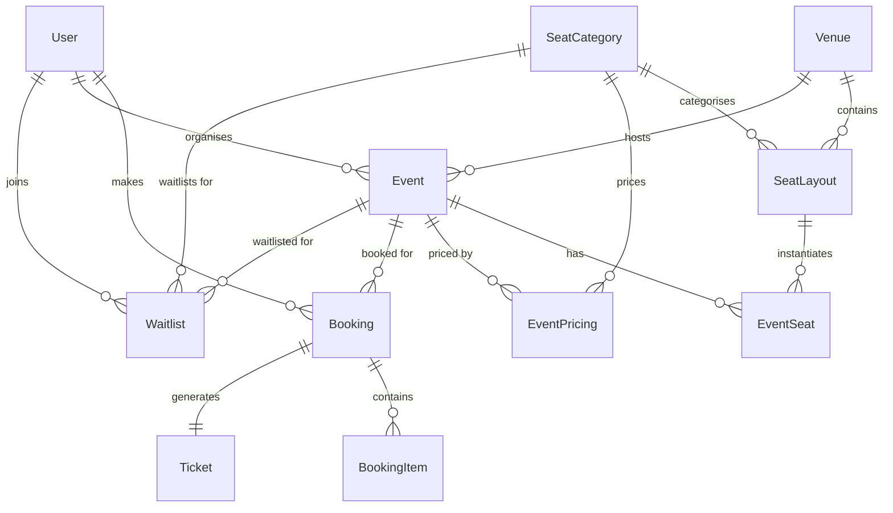

# 🎬 Ticket Booking System

A **full-stack, production-grade** ticket booking platform built with **Next.js 15**, **Prisma**, and **Redis**. Designed to handle high-concurrency seat reservations for movies and concerts with zero double-bookings.

> **Core Innovation:** Uses **Redis SETNX** for atomic distributed seat locks with automatic TTL expiry, paired with Prisma interactive transactions for ACID-compliant final bookings.

---

## 📑 Table of Contents

- [Features](#-features)
- [System Architecture](#-system-architecture)
- [Tech Stack](#-tech-stack)
- [Project Structure](#-project-structure)
- [Getting Started](#-getting-started)
- [Environment Variables](#-environment-variables)
- [Database Schema](#-database-schema)
- [API Reference](#-api-reference)
- [Concurrency & Seat Hold Mechanism](#-concurrency--seat-hold-mechanism)
- [Waitlist Auto-Assignment](#-waitlist-auto-assignment)
- [Role-Based Access](#-role-based-access)
- [Demo Credentials](#-demo-credentials)

---

## ✨ Features

### 🔒 Concurrency-Safe Booking
- **Redis SETNX** atomic locks prevent double-booking under high concurrency
- Seats are **held for 10 minutes** (configurable TTL) during checkout
- Automatic rollback if hold expires — no orphaned locks
- **Optimistic concurrency control** with version fields in the database

### 🪑 Interactive Seat Map
- Real-time seat availability with **5-second polling**
- Color-coded seat categories (Premium / Standard)
- Visual status indicators: Available → Selected → Held → Booked
- Maximum 10 seats per booking

### 📋 Automated Waitlist
- FIFO queue per seat category when events sell out
- **Secure, time-limited offer tokens** sent via email
- Automatic rollover to next in line if offer expires
- Cron job for expired offer cleanup

### 🎫 QR Code Tickets
- Auto-generated QR codes embedded with booking reference
- Sent as **email attachments** with a styled HTML confirmation
- Scannable at venue entrance for verification

### 👥 Multi-Role System
- **Admin** — Create venues, manage seat layouts
- **Organiser** — Create events, set pricing, view analytics dashboard
- **Customer** — Browse events, book seats, manage bookings

### 📧 Email Notifications
- Booking confirmation with QR ticket attachment
- Waitlist offer alerts with one-click booking link
- Styled HTML email templates

---

## 🏗 System Architecture

```
┌──────────────────────────────────────────────────────┐
│                      CLIENT                          │
│        Next.js App Router (React 18 + SSR)           │
│  ┌──────────┐  ┌──────────┐  ┌────────────────────┐ │
│  │ Seat Map  │  │ Checkout │  │ Organiser Dashboard│ │
│  └──────────┘  └──────────┘  └────────────────────┘ │
└───────────────────────┬──────────────────────────────┘
                        │ HTTP (API Routes)
┌───────────────────────▼──────────────────────────────┐
│                   API LAYER                          │
│            Next.js Route Handlers                    │
│  ┌─────────┐ ┌──────────┐ ┌────────┐ ┌──────────┐  │
│  │ /events │ │ /seats   │ │/checkout│ │/waitlist │  │
│  └─────────┘ └──────────┘ └────────┘ └──────────┘  │
└──────┬────────────────┬──────────────────┬───────────┘
       │                │                  │
┌──────▼───────┐ ┌──────▼───────┐  ┌──────▼───────────┐
│   Prisma     │ │    Redis     │  │   Nodemailer     │
│  (SQLite /   │ │  (In-Memory  │  │  (SMTP Email)    │
│  PostgreSQL) │ │   Mock/Real) │  │                  │
│              │ │              │  │  ┌────────────┐  │
│  • Users     │ │  • SETNX     │  │  │ QR Code    │  │
│  • Events    │ │    Locks     │  │  │ Generator  │  │
│  • Bookings  │ │  • TTL       │  │  └────────────┘  │
│  • Waitlist  │ │    Expiry    │  │                  │
└──────────────┘ └──────────────┘  └──────────────────┘
```

---

## 🛠 Tech Stack

| Layer        | Technology                          |
|-------------|--------------------------------------|
| **Framework**   | Next.js 15 (App Router)          |
| **Language**    | TypeScript                       |
| **Frontend**    | React 18, Tailwind CSS           |
| **Auth**        | NextAuth.js v4 (JWT + Credentials) |
| **ORM**         | Prisma 6                        |
| **Database**    | SQLite (dev) / PostgreSQL (prod) |
| **Cache/Locks** | Redis (via `ioredis`) — in-memory mock for dev |
| **Validation**  | Zod v4                           |
| **Email**       | Nodemailer                       |
| **QR Codes**    | `qrcode` library                 |
| **Passwords**   | bcryptjs                         |
| **IDs**         | UUID v4                          |

---

## 📂 Project Structure

```
ticket-booking-app/
├── prisma/
│   ├── schema.prisma          # Database schema (10 models)
│   ├── seed.ts                # Seed script with demo data
│   └── migrations/            # Prisma migrations
├── src/
│   ├── app/
│   │   ├── page.tsx           # Landing page (Hero + Events)
│   │   ├── layout.tsx         # Root layout with providers
│   │   ├── globals.css        # Design system & animations
│   │   ├── admin/
│   │   │   └── page.tsx       # Admin: Venue creation
│   │   ├── auth/
│   │   │   ├── signin/        # Sign-in page
│   │   │   └── register/      # Registration page
│   │   ├── bookings/
│   │   │   └── page.tsx       # User's booking history
│   │   ├── events/
│   │   │   ├── page.tsx       # Events listing
│   │   │   └── [id]/          # Event detail + seat map
│   │   ├── organiser/
│   │   │   └── page.tsx       # Organiser dashboard
│   │   └── api/
│   │       ├── auth/
│   │       │   ├── [...nextauth]/  # NextAuth handlers
│   │       │   └── register/       # Registration endpoint
│   │       ├── events/
│   │       │   ├── route.ts        # GET/POST events
│   │       │   └── [id]/           # Event details + seats
│   │       ├── seats/
│   │       │   └── hold/route.ts   # POST (hold) / DELETE (release)
│   │       ├── checkout/
│   │       │   └── route.ts        # POST — finalize booking
│   │       ├── bookings/
│   │       │   ├── route.ts        # GET user bookings
│   │       │   └── cancel/         # POST cancel booking
│   │       ├── waitlist/
│   │       │   └── route.ts        # POST (join) / GET (list)
│   │       ├── venues/
│   │       │   └── route.ts        # GET/POST venues
│   │       ├── organiser/
│   │       │   └── dashboard/      # Organiser analytics
│   │       └── cron/
│   │           └── cleanup/        # Expired hold cleanup
│   ├── components/
│   │   ├── AuthProvider.tsx    # NextAuth session provider
│   │   ├── CountdownTimer.tsx  # 10-min checkout timer
│   │   ├── Navbar.tsx          # Navigation with role-based links
│   │   └── SeatMap.tsx         # Interactive seat selection grid
│   ├── lib/
│   │   ├── auth.ts            # NextAuth config (Credentials)
│   │   ├── email.ts           # Booking & waitlist email templates
│   │   ├── prisma.ts          # Prisma client singleton
│   │   ├── qrcode.ts          # QR code generation
│   │   └── redis.ts           # Redis SETNX lock helpers
│   └── types/
│       └── next-auth.d.ts     # NextAuth type extensions
├── System_Design.md           # Detailed system design document
├── .env.example               # Environment variable template
├── package.json
├── tailwind.config.ts
├── tsconfig.json
└── next.config.mjs
```

---

## 🚀 Getting Started

### Prerequisites

- **Node.js** ≥ 18.x
- **npm** ≥ 9.x
- **Redis** (optional — falls back to in-memory mock for development)

### 1. Clone the Repository

```bash
git clone https://github.com/Akash-patel08/Ticket_booking.git
cd Ticket_booking
```

### 2. Install Dependencies

```bash
npm install
```

### 3. Configure Environment

```bash
cp .env.example .env
```

Edit `.env` with your values (see [Environment Variables](#-environment-variables)).

### 4. Set Up the Database

```bash
# Generate Prisma client
npx prisma generate

# Run migrations
npx prisma migrate dev

# Seed with demo data
npx tsx prisma/seed.ts
```

### 5. Start the Development Server

```bash
npm run dev
```

Open [http://localhost:3000](http://localhost:3000) to view the application.

---

## 🔐 Environment Variables

Create a `.env` file from the provided template:

| Variable | Description | Default |
|----------|-------------|---------|
| `DATABASE_URL` | Prisma database connection string | `file:./dev.db` |
| `NEXTAUTH_SECRET` | JWT signing secret for NextAuth | — |
| `NEXTAUTH_URL` | App base URL | `http://localhost:3000` |
| `REDIS_URL` | Redis connection URL | `redis://localhost:6379` |
| `SMTP_HOST` | Email SMTP host | `smtp.gmail.com` |
| `SMTP_PORT` | Email SMTP port | `587` |
| `SMTP_USER` | Email account username | — |
| `SMTP_PASS` | Email app password | — |
| `EMAIL_FROM` | Sender email address | `TicketBooking <noreply@ticketbooking.com>` |
| `SEAT_HOLD_TTL_SECONDS` | Seat hold duration in seconds | `600` (10 min) |
| `WAITLIST_OFFER_TTL_MINUTES` | Waitlist offer validity | `30` |

---

## 🗄 Database Schema

The system uses **10 Prisma models** across 4 domains:

### Users & Auth
- **`User`** — id, name, email, passwordHash, role (`ADMIN` / `ORGANISER` / `CUSTOMER`)

### Venues & Seating
- **`Venue`** — id, name, address, totalRows, totalCols
- **`SeatCategory`** — id, name, color (e.g., Premium 🟡, Standard 🔵)
- **`SeatLayout`** — Maps each physical seat to a venue + category (row, col, label)

### Events
- **`Event`** — id, title, description, type (MOVIE/CONCERT), date, time, venueId, organiserId
- **`EventPricing`** — Price per seat category per event
- **`EventSeat`** — Per-show seat instance with status (`AVAILABLE` → `HELD` → `BOOKED`), optimistic version control

### Bookings & Waitlist
- **`Booking`** — id, bookingRef, userId, eventId, totalAmount, status (`CONFIRMED` / `CANCELLED`)
- **`BookingItem`** — Individual seat line items within a booking
- **`Ticket`** — QR code data linked to a booking
- **`Waitlist`** — FIFO queue entries with status (`WAITING` → `OFFERED` → `EXPIRED` → `COMPLETED`), secure offer tokens

### ER Diagram



---

## 📡 API Reference

### Authentication

| Method | Endpoint | Description |
|--------|----------|-------------|
| `POST` | `/api/auth/register` | Register a new user |
| `POST` | `/api/auth/[...nextauth]` | NextAuth sign-in/sign-out |

### Events

| Method | Endpoint | Description |
|--------|----------|-------------|
| `GET` | `/api/events` | List all events (supports `?upcoming=true`) |
| `POST` | `/api/events` | Create event (Organiser/Admin) |
| `GET` | `/api/events/[id]` | Get event details with seats |

### Seat Management

| Method | Endpoint | Description |
|--------|----------|-------------|
| `POST` | `/api/seats/hold` | Hold seats (Redis SETNX lock) |
| `DELETE` | `/api/seats/hold` | Release held seats |

### Checkout

| Method | Endpoint | Description |
|--------|----------|-------------|
| `POST` | `/api/checkout` | Finalize booking (Prisma transaction) |

### Bookings

| Method | Endpoint | Description |
|--------|----------|-------------|
| `GET` | `/api/bookings` | Get user's bookings |
| `POST` | `/api/bookings/cancel` | Cancel a booking |

### Waitlist

| Method | Endpoint | Description |
|--------|----------|-------------|
| `POST` | `/api/waitlist` | Join waitlist for a seat category |
| `GET` | `/api/waitlist` | Get user's waitlist entries |

### Venues

| Method | Endpoint | Description |
|--------|----------|-------------|
| `GET` | `/api/venues` | List venues with seat layouts |
| `POST` | `/api/venues` | Create venue with categories (Admin) |

### Admin / Organiser

| Method | Endpoint | Description |
|--------|----------|-------------|
| `GET` | `/api/organiser/dashboard` | Organiser analytics & revenue |
| `POST` | `/api/cron/cleanup` | Clean up expired seat holds |

---

## 🔐 Concurrency & Seat Hold Mechanism

This is the **core differentiator** of the system. The booking flow uses a **two-phase commit** pattern with Redis as the distributed lock manager:

### Phase 1: Seat Hold (Redis)

```
User selects seats → POST /api/seats/hold
                         │
                         ▼
              ┌─────────────────────┐
              │  For each seat:     │
              │  Redis SETNX        │
              │  key: seat_hold:    │
              │    {eventId}:{id}   │
              │  value: userId      │
              │  TTL: 600s          │
              └─────────┬───────────┘
                        │
              ┌─────────▼───────────┐
              │  All succeeded?     │
              │  YES → Hold OK      │
              │  NO  → Rollback all │
              └─────────────────────┘
```

1. Generate Redis key: `seat_hold:{eventId}:{seatLayoutId}`
2. Execute `SETNX` (Set if Not Exists) — **atomic operation**
3. If key exists → seat held by another user → **reject**
4. If key set → apply 600s TTL → update DB status to `HELD`
5. All-or-nothing: if any seat fails, rollback all successful holds

### Phase 2: Checkout (Prisma Transaction)

```
User completes payment → POST /api/checkout
                              │
                              ▼
                    ┌──────────────────┐
                    │ 1. Verify Redis  │
                    │    holds exist   │
                    │ 2. Prisma $tx    │
                    │    - Verify DB   │
                    │    - BOOKED      │
                    │    - Create      │
                    │      Booking     │
                    │    - QR Code     │
                    │ 3. Delete Redis  │
                    │    keys          │
                    │ 4. Send email    │
                    └──────────────────┘
```

### Why Redis over Database Locks?

| Approach | Pros | Cons |
|----------|------|------|
| **DB `SELECT FOR UPDATE`** | ACID compliant | Heavy write load; abandoned checkouts bloat DB |
| **Redis SETNX + TTL** ✅ | Automatic expiry; near-zero latency; no DB pressure | Eventually consistent (mitigated by dual verification) |

---

## 📋 Waitlist Auto-Assignment

When all seats in a category are booked, users can join a **FIFO waitlist**:

```
Cancellation Occurs
       │
       ▼
┌──────────────────┐
│ Seats → AVAILABLE│
│ in DB            │
└───────┬──────────┘
        │
        ▼
┌──────────────────┐       ┌──────────────────┐
│ Query Waitlist   │──────▶│ Generate secure  │
│ ORDER BY         │       │ offer token      │
│ createdAt ASC    │       │ (time-limited)   │
└──────────────────┘       └───────┬──────────┘
                                   │
                           ┌───────▼──────────┐
                           │ Send email with  │
                           │ booking link     │
                           └───────┬──────────┘
                                   │
                    ┌──────────────▼────────────────┐
                    │ Claimed?                      │
                    │ YES → Book seats → COMPLETED  │
                    │ NO  → Cron expires → EXPIRED  │
                    │       → Offer next in line    │
                    └───────────────────────────────┘
```

---

## 👤 Role-Based Access

| Feature | Admin | Organiser | Customer |
|---------|:-----:|:---------:|:--------:|
| Create venues & seat layouts | ✅ | ❌ | ❌ |
| Create events & set pricing | ✅ | ✅ | ❌ |
| View organiser dashboard | ✅ | ✅ | ❌ |
| Browse & search events | ✅ | ✅ | ✅ |
| Book seats | ✅ | ✅ | ✅ |
| View & cancel bookings | ✅ | ✅ | ✅ |
| Join waitlist | ✅ | ✅ | ✅ |

---

## 🔑 Demo Credentials

After running the seed script, the following accounts are available:

| Role | Email | Password |
|------|-------|----------|
| **Admin** | `admin@ticketbooking.com` | `admin123` |
| **Organiser** | `organiser@ticketbooking.com` | `organiser123` |
| **Customer** | `customer@ticketbooking.com` | `customer123` |

The seed also creates:
- 🏟️ **1 venue** — Grand Cinema Hall (8 rows × 12 seats = 96 seats)
- 🎬 **4 sample events** — 3 movies + 1 concert
- 💰 **Pricing** — Premium ₹500, Standard ₹250

---

## 📄 License

This project is built for educational and portfolio purposes.

---

<p align="center">
  Built with ❤️ by <a href="https://github.com/Akash-patel08">Akash Patel</a>
</p>
